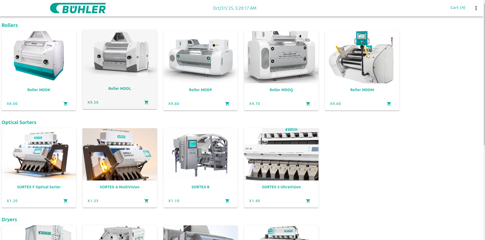

# Vue 3 Product Store App

A simple Vue 3 application using **Composition API**, **Vuetify 3**, and **Vue Router 4**.  
It allows users to:

- View a list of products
- View product details
- Add or remove products from a checkout list
- Compute total price dynamically
- Generate unique 6-digit IDs for products
- Use reactive state sharing with `provide` / `inject`

---

## **Project Structure**

<pre>
src/
├─ components/
│ ├─ Card.vue
├─ pages/
│ ├─ ProductList.vue
│ ├─ checkOutList.vue
│ └─ ProductDetails.vue
├─ plugin/
│ └─ vuetify
├─ router/
│ └─ home.js
│ └─ index.js
├─ App.vue
└─ main.js
</pre>


---

## **Features**

1. **Dynamic Routing**  
   - `/product` → Product List  
   - `/details/:id` → Product Details  

2. **Reactive Store with provide/inject**  
   - Shared `productStore` across components  
   - Children can `addProduct` and `removeProduct`  

3. **Checkout Page**  
   - Displays all products in cart  
   - Computes total price using `computed`  

4. **6-digit ID Generator**  
```js
const generateId = () => Math.floor(100000 + Math.random() * 900000).toString();
```

## Setup Instructions

1. Clone the repository

```
git clone https://github.com/rajendraradiya/online-store.git

cd ONLINE-STORE-APP
```
2. Install dependencie
```
npm install
```
3. Run development server

```
npm run dev
```

## Dependencies

Vue 3

Vue Router 4

Vuetify 3

## ScreenShot

